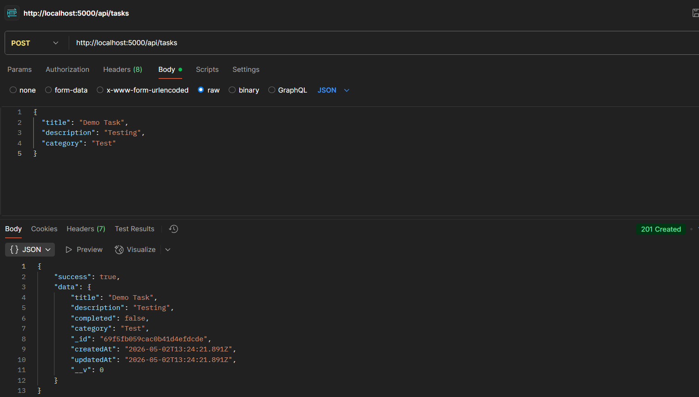
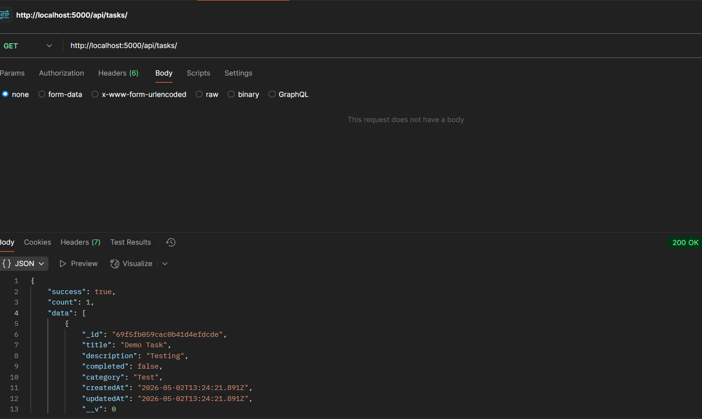
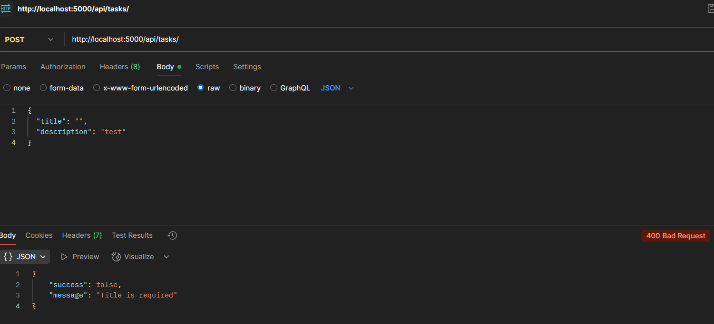

# Task Manager API

A production-ready RESTful Task Management API built using **Node.js, Express, and MongoDB**.
Designed with clean architecture, validation, and real-world backend practices.

---

## 🚀 Features

* Create Task
* Get All Tasks (with filtering & pagination)
* Update Task
* Delete Task
* Mark Task as Completed
* Due Date Validation (cannot be past)
* Input Validation (title required, non-empty)
* Centralized Error Handling
* RESTful API Design

---

## 🛠 Tech Stack

* Node.js
* Express.js
* MongoDB (Mongoose)

---

## 📁 Project Structure

```
task-manager-api/
│
├── controllers/
├── models/
├── routes/
├── config/
├── screenshots/
├── app.js
├── server.js
└── README.md
```

---

## ⚙️ Installation & Setup

```bash
git clone https://github.com/MEET0605/task-manager-api.git
cd task-manager-api
npm install
```

Create `.env` file:

```
PORT=5000
MONGO_URI=your_mongodb_connection_string
```

Run server:

```bash
npm run dev
```

---

## 🔗 API Endpoints

| Method | Endpoint                | Description         |
| ------ | ----------------------- | ------------------- |
| POST   | /api/tasks              | Create Task         |
| GET    | /api/tasks              | Get All Tasks       |
| PUT    | /api/tasks/:id          | Update Task         |
| DELETE | /api/tasks/:id          | Delete Task         |
| PATCH  | /api/tasks/:id/complete | Mark Task Completed |

---

## 📥 Example Request

### Create Task

```json
{
  "title": "Learn Node",
  "description": "Practice backend",
  "category": "Study"
}
```

---

## ✅ Validation Rules

* Title is required
* Title cannot be empty
* Due date cannot be in the past
* Invalid MongoDB ID handled properly

---

## 🧪 Testing

Tested using **Postman**:

* CRUD operations verified
* Validation errors tested
* Invalid ID handling verified
* Pagination & filtering tested
  
### Pagination Example
GET /api/tasks?page=1&limit=5

### Filtering Example
GET /api/tasks?completed=true
---

## 📸 Screenshots

### Create Task (POST)



### Get Tasks (GET)



### Validation Error (400 Bad Request)



---

## 🧠 Key Decisions

* MVC architecture for scalability
* Clean separation of concerns
* Validation at controller level
* Pagination & filtering for performance
* Proper HTTP status codes used

---

## 🔮 Future Improvements

* JWT Authentication
* Role-based access
* Deployment (Render / Railway)
* Frontend integration (React)

---

## 👨‍💻 Author

**Meet Prajapati**
